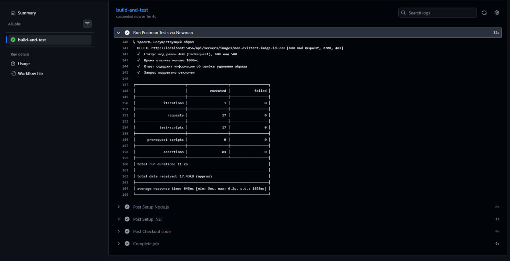
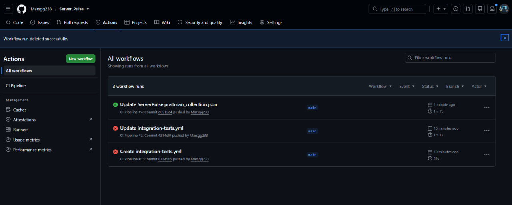

# Integration Testing & Backend Management (ServerPulse)

Проект представляет собой C# ASP.NET Core бэкенд для управления игровыми серверами через Docker, а также набор интеграционных тестов для проверки всех эндпоинтов

## Процесс запуска и результаты работы

### 1. Запуск бэкенда
Мы переходим в директорию проекта и запускаем сервер с помощью команды `dotnet run`. Приложение успешно стартует и начинает прослушивать порт `http://localhost:5056`

### 2. Документация API (Swagger)
После запуска бэкенда доступен интерфейс Swagger UI (`/swagger`), где представлены все эндпоинты для управления игровыми серверами, контейнерами Docker (`/api/servers`) и образами

### 3. Интеграционное тестирование в Postman
Для проверки работоспособности используется коллекция тестов в Postman. Все 84 тест-кейса успешно пройдены (зеленый статус), что подтверждает корректность работы бизнес-логики, обработки ошибок и интеграции с Docker

### 4. Автоматизированное тестирование через Newman (CLI)
Сводная таблица результатов локального и консольного прогона интеграционных тестов через Newman. Все запросы и проверки отработали штатно, подтверждая стабильность API вне графического интерфейса Postman

### 5. Успешное выполнение CI/CD пайплайна
Финальный статус сборки и прогона тестов в GitHub Actions CI. Пайплайн полностью зелёный, все интеграционные тесты и Docker-операции успешно выполнены в изолированном окружении раннера

