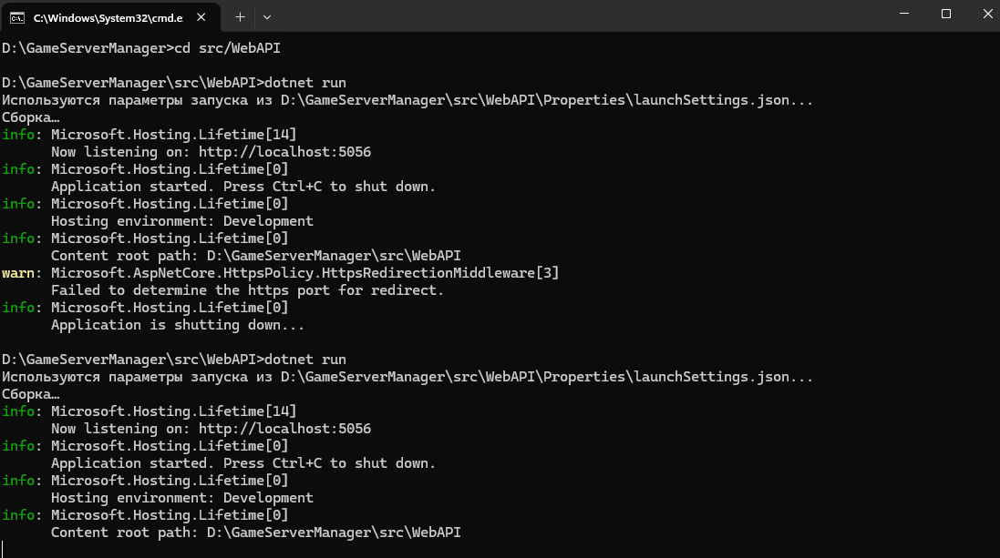
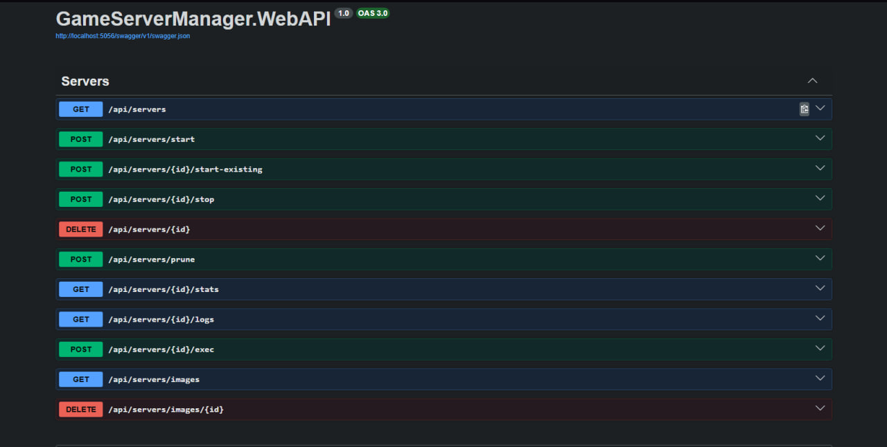
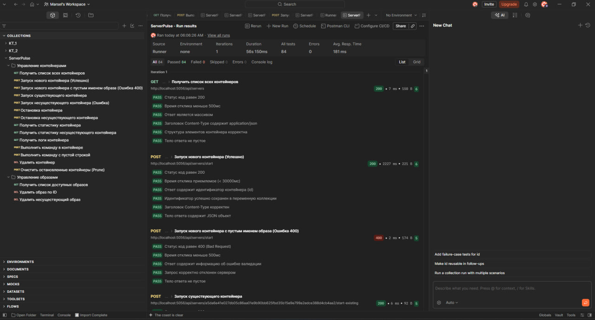

# Integration Testing & Backend Management (ServerPulse)

Проект представляет собой C# ASP.NET Core бэкенд для управления игровыми серверами через Docker, а также набор интеграционных тестов для проверки всех эндпоинтов.

## Процесс запуска и результаты работы

### 1. Запуск бэкенда
Мы переходим в директорию проекта и запускаем сервер с помощью команды `dotnet run`. Приложение успешно стартует и начинает прослушивать порт `http://localhost:5056`.

### 2. Документация API (Swagger)
После запуска бэкенда доступен интерфейс Swagger UI (`/swagger`), где представлены все эндпоинты для управления игровыми серверами, контейнерами Docker (`/api/servers`) и образами.

### 3. Интеграционное тестирование в Postman
Для проверки работоспособности используется коллекция тестов в Postman. Все 84 тест-кейса успешно пройдены (зеленый статус), что подтверждает корректность работы бизнес-логики, обработки ошибок и интеграции с Docker.

